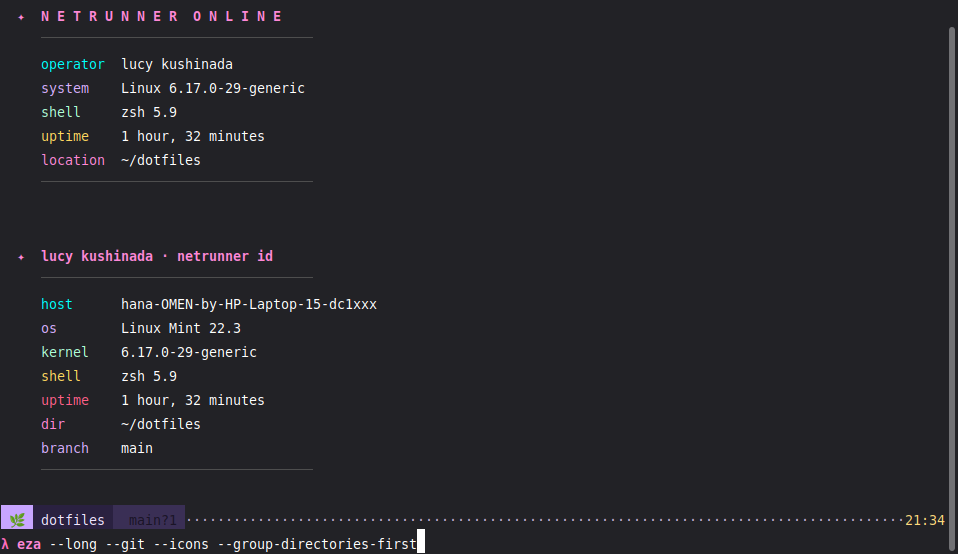

<div align="center">


# ✦ Lucy Edgerunner+ Dotfiles

**Cyberpunk Edgerunners-themed development environment — one palette, ten tools**  
Neovim · Zsh · Tmux · Starship · Ghostty · WezTerm · Kitty · Sketchybar · AeroSpace · Zellij

[](LICENSE)
[](install.sh)
[](https://github.com/kyuna0312/dotfiles)

</div>

---

## Preview

<div align="center">



<sub>Lucy greeting · `lucy` identity card · Starship `λ` prompt with git status · syntax-highlighted command line</sub>

</div>

---

## Quick Install

```bash
git clone --recurse-submodules https://github.com/kyuna0312/dotfiles ~/dotfiles
cd ~/dotfiles && bash install.sh
```

Or directly, without cloning:

```bash
# curl
sh -c "$(curl -fsSL https://raw.githubusercontent.com/kyuna0312/dotfiles/main/install.sh)"

# wget
sh -c "$(wget -qO- https://raw.githubusercontent.com/kyuna0312/dotfiles/main/install.sh)"
```

> **Re-link only** (skip package installs): `bash install.sh --skip-packages`  
> **With pentest tools**: `bash install.sh --security`

---

## What's Included

| Component | Config path | Description |
|-----------|-------------|-------------|
| **Zsh** | `home/.zshenv` → `config/zsh/.zshrc` + `lib/` | Modular OS-split shell; Lucy greeting, fzf, zoxide, lazy NVM |
| **Starship** | `config/starship/starship.toml` | `λ` prompt, Lucy ribbon on stack tokens, OS badge, git status |
| **Neovim** | `config/nvim/` → [NyanVim](https://github.com/kyuna0312/NyanVim) | tokyonight-moon re-grounded on the Lucy palette (git submodule) |
| **Tmux** | `config/tmux/tmux.conf` | Magenta window tabs, undercurl passthrough, [NyanVim session manager](https://github.com/kyuna0312/nyan_tmux_session_manager) popups |
| **Ghostty** | `config/ghostty/config` | Full 16-color Lucy palette, cyan cursor, 0.9 opacity + blur |
| **WezTerm** | `config/wezterm/wezterm.lua` | Same palette in lua; magenta active tab bar |
| **Kitty** | `config/kitty/kitty.conf` | Same palette; ready the day it's installed |
| **Sketchybar** | `macos/sketchybar/` | Translucent navy bar, cyan calendar pill, magenta workspace highlight |
| **AeroSpace** | `macos/aerospace/aerospace.toml` | Tiling WM + JankyBorders cyan focus ring |
| **Zellij** | `config/zellij/config.kdl` | Custom `lucy` theme |
| **Nushell** | `config/nushell/` | Explicit-hex `lucy_theme` color_config |
| **Git** | `config/git/delta.gitconfig` | Delta pager with Lucy syntax colors |
| **Atuin** | `config/atuin/config.toml` | Encrypted shell history sync |
| **Security** | `config/zsh/lib/security.zsh` | Pentest alias layer (`sectools` for reference) |

---

## OS Support

| OS | Package manager | Notes |
|----|----------------|-------|
| **Arch / Manjaro** | pacman + paru (AUR) | Full support |
| **Debian / Ubuntu** | apt | `bat`→`batcat`, `fd`→`fdfind` aliased automatically |
| **macOS** | Homebrew | Aerospace, Sketchybar, Hammerspoon, Karabiner |

---

## Color Palette — H4CK3R // LUCY

One token set across every tool — terminal, editor, prompt, bar, window borders.

| Name | Hex | Role |
|------|-----|------|
| **Night Navy** | `#0a0a1a` | the ground everywhere — terminal, editor, bar |
| **Surface** | `#0d0d1a` / `#1a1a2e` | panels, floats, inactive tabs |
| **Magenta** | `#ff2a7a` | active only: current tab, selected row, keywords |
| **Neon Cyan** | `#00e5ff` | where attention goes: cursor, focus ring, links |
| **Lucy Blue** | `#45c2f0` | structure: pane borders, functions, flags |
| **Violet** | `#b967ff` | secondary accent: picker frame, dates, numbers |
| **Matrix** | `#00ff41` | one badge, one accent — never body text |
| **Gold** | `#ffa600` | time, warnings, operators |
| **Silver Blue** | `#c4d0e0` | running text on the navy ground |

---

## Keymap

| Key | Action | Scope |
|-----|--------|-------|
| `C-a i` | NyanVim session for this directory | tmux |
| `C-a u` | ⚡ NyanVim picker — jump / kill | tmux |
| `C-a y` | Claude Code popup for this directory | tmux |
| `C-a g` | lazygit popup | tmux |
| `C-a F` | Open this directory in Finder | tmux |
| `C-S-←/→` | Reorder windows | tmux |
| `alt-hjkl` | Focus window left/down/up/right | AeroSpace |
| `alt-1…4` | Jump to workspace | AeroSpace |

---

## Shell Features

Zsh uses `ZDOTDIR=~/.config/zsh` (set by `home/.zshenv`), so all zsh config lives under `config/zsh/`. Plugins are managed by [Sheldon](https://sheldon.cli.rs/) (`config/sheldon/plugins.toml`).

### Lucy Zsh Layer (`config/zsh/lib/lucy.zsh`)

Sourced last, after syntax highlighting. Provides:

| Command | Description |
|---------|-------------|
| `lucy` | Identity card with system info |
| `jack-in <host>` | Styled SSH wrapper |
| `flatline <name>` | Kill process by name (`pkill -f`) |
| `breach [dir]` | `cd` into directory then open `$EDITOR` |
| `ghost` | Browse history with fzf and re-run |
| `ports` | Open listening ports (`ss -tulnp`) |

> `dp-tools` (alias `netrunner-tools`) prints the CLI stack reference card — defined in `config/zsh/lib/common.zsh`.

### Security Layer (`config/zsh/lib/security.zsh`)

Auto-loaded when `nmap` or `burpsuite` is detected. Run `sectools` for a quick reference.

| Category | Tools |
|----------|-------|
| Network | `nmap`, `nse`, `nnmap`, `sniff`, `sniffport` |
| Web | `bsuite`, `sqlm`, `nik` |
| Passwords | `jtr`, `hcat` |
| Reverse Eng | `ghidra-launch`, `r2` |
| CTF | `b64d`, `b64e`, `hexdump-clean`, `rot13` |

---

## Configuration

### Git identity

Put user-specific git config in `~/.gitconfig.local` (not tracked):

```ini
[user]
    name = Your Name
    email = you@example.com
    signingkey = GPGKEYID

[commit]
    gpgsign = true
```

### NVM lazy loading

`nvm`, `node`, `npm`, `npx` are stub functions — NVM loads on first call to keep shell startup fast. Run `nvm` once to initialize.

### Kubectl completion

Set `CYBERPUNK_KUBECTL_COMPLETION=0` to disable kubectl completion (removes startup latency when kubectl is installed but not actively used).

### Tmux plugins

On first launch, install TPM plugins:

```
Start tmux → Ctrl+I
```

### Neovim

On first launch, sync all plugins:

```
nvim → :Lazy sync
```

---

## Directory Structure

```
dotfiles/
├── install.sh              # thin linker (packages + symlinks)
├── lib/link.sh             # symlink + logging helpers
├── home/                   # files linked to $HOME
│   ├── .zshenv             # sets ZDOTDIR=~/.config/zsh
│   └── .bashrc             # minimal bash fallback
├── config/                 # mirrors ~/.config, linked dir-by-dir
│   ├── zsh/
│   │   ├── .zshrc          # zsh entrypoint
│   │   └── lib/
│   │       ├── common.zsh  # shared: aliases, fzf, nvm, zoxide
│   │       ├── linux.zsh   # Linux: tmux auto-attach, EDITOR, security
│   │       ├── macos.zsh   # macOS specifics
│   │       ├── lucy.zsh    # Lucy layer: greeting, themed helpers
│   │       └── security.zsh # pentest alias layer
│   ├── sheldon/plugins.toml # zsh plugin manifest (Sheldon)
│   ├── starship/starship.toml
│   ├── nvim/               # NyanVim (git submodule)
│   ├── tmux/tmux.conf
│   ├── ghostty/config
│   ├── kitty/kitty.conf
│   ├── wezterm/wezterm.lua
│   ├── zellij/config.kdl
│   ├── git/delta.gitconfig
│   ├── bat/config
│   ├── nushell/
│   └── atuin/
├── installers/             # per-distro package installers
│   ├── arch.sh
│   ├── debian.sh
│   └── macos.sh
├── packages/               # package lists (edit to add tools)
│   ├── arch-base.txt
│   ├── arch-security.txt
│   └── ...
├── macos/                  # aerospace, sketchybar, skhd, karabiner, hammerspoon
├── scripts/
│   └── apply-theme.sh      # hot-reload all running apps
└── assets/                 # README images (preview.png, logo.png)
```

---

## Prerequisites

- `git`, `zsh`, `curl`
- Recommended: `neovim`, `tmux`, `starship`, `fzf`, `eza`

---

<div align="center">

**Lucy Kushinada — Netrunner Online**  
<sub>built with ✦ and neon pink</sub>

</div>
